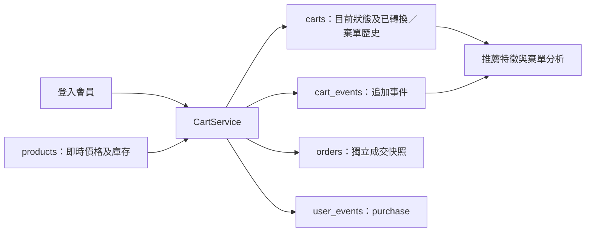

> 歷史版本：2026-09-19 已更新為 Complete Schema v4。現行架構與執行入口以 [15](15_完整Schema_v4架構與遷移.md) 及 [16](16_完整Schema_v4驗證與欄位字典.md) 為準；以下數字與命令描述原查核時點。

> **2026-09-18 更新：** 購物車結構維持 v3；其他條件驗證已進一步補強。現行驗證改用 schema_current.verify_current／audit_schema.py，遷移鏈最後增加 migrate_schema_audit.py。完整狀態见 [全集合查核](12_全部Schema文件對照與驗證.md)。本文其餘購物車設計仍有效。

# 購物車 v3 架構與服務整合

更新日期：2026-09-17。依據 [購物車更新原始規格](07_購物車更新規格_來源快照.md)，購物車部分優先於原整合規格 v1.1；其他集合維持原設計。

## 現行資料模型



共 14 集合：既有 13 集合保留，新增 cart_events。carts 與 cart_events 使用 schema_version=3，其餘集合仍為 2；沒有把原 schema v2 遷移 checksum 改寫。

### carts

|欄位|型別／限制|用途|
|---|---|---|
|_id、user_id|ObjectId，必填|購物車及登入會員識別|
|schema_version|Int，3|辨識本次結構|
|status|active / converted / abandoned|一會員最多一份 active，歷史可多份|
|revision|Int ≥ 0|每次狀態變動加 1；結帳核對版本|
|items|Array，最多 20 個不同商品|保持內嵌項目|
|items.product_id|ObjectId|商品參照|
|items.quantity|Int，1～99|0 不隱式代表移除，須呼叫 remove_item|
|items.price_snapshot|Decimal128，非負且最多兩位小數|新增／確認數量時的售價快照|
|items.added_at|Date UTC|首次加入時間，不因改數量重設|
|items.updated_at|Date UTC|項目最後修改時間|
|created_at、updated_at|Date UTC|購物車生命週期|

空 active Cart 可保留；離站不清除、不設 TTL。成功結帳僅將 status 改 converted，保留 items 與原價格快照；下次加購建立新的 active Cart。棄單將 status 改 abandoned 並保留歷史。

### cart_events

|欄位|型別／限制|用途|
|---|---|---|
|_id、cart_id、user_id|ObjectId|事件、購物車與會員識別|
|schema_version|Int，3|事件結構版本|
|operation_id|String，1～128 字|同會員下唯一，處理請求重送|
|request_hash|64 位 SHA-256 字串|同 key 不同內容拒絕|
|event_type|大寫字母／數字／底線，最多 40 字|服務實作 ADD、REMOVE、QTY_CHANGE、CHECKOUT、ABANDON；允許未來新事件|
|product_id|ObjectId/null|商品事件有值；整車事件 null|
|quantity_before、quantity_after|Int 0～99/null|商品異動前後數量；整車事件 null|
|price_snapshot|Decimal128/null|商品事件的快照，整車事件 null|
|event_at、created_at|Date UTC|事件時間與建立时间|
|metadata|Object，BSON 大小 ≤ 2 KB|服務目前只在 CHECKOUT 寫 order_id；不收客戶端任意欄位|

ADD：after > before。REMOVE：before > 0、after = 0。QTY_CHANGE：前後均 > 0 且不同。CHECKOUT／ABANDON 的商品及數量欄位為 null。Schema 保留未來事件格式擴充空間；新的事件仍需由服務白名單明確實作。

事件由服務只新增、不修改或刪除；這不是資料庫級不可變儲存。現有 readWrite 帳號仍有 MongoDB 更新／刪除權限，不能宣稱管理員也無法改寫。只有自動化驗證的測試事件會在測試後按生成的會員 ID 清除。

## 索引差異

舊 uq_carts_user_id 限制每會員只能一車，會阻止保存歷史；本次先建立 active 部分唯一索引，再移除已核實的舊索引。未刪除任何集合或業務文件。

|集合|索引|選項／用途|
|---|---|---|
|carts|user_id:1|uq_carts_user_id_active，unique，partialFilterExpression={status:active}|
|carts|user_id:1,status:1|會員車歷史；user_id 前綴也支援單欄查詢|
|carts|status:1,updated_at:1|狀態／棄單掃描；status 前綴支援單欄查詢|
|carts|updated_at:1|時間查詢|
|cart_events|cart_id:1,event_at:-1|購物車歷史|
|cart_events|user_id:1,event_at:-1|會員特徵|
|cart_events|event_type:1,event_at:-1|事件統計|
|cart_events|product_id:1,event_at:-1|商品分析|
|cart_events|user_id:1,operation_id:1|unique；請求冪等|

目前 31 個自訂索引，加 14 個 _id_，共 45 個；自訂唯一索引 12 個，TTL 仍只有 ai_insights、request_limits 的 2 個。cart_events 不設 TTL。

## Cart Service

程式：[cart_service.py](../services/cart_service.py)。依賴既有 PyMongo/BSON；使用傳入的 Database 與同一 MongoClient 的 session，不另建連線。

```python
service = CartService(database, enable_checkout=False)
cart = service.get_active_cart(authenticated_user_id)
cart = service.add_item(authenticated_user_id, product_id, 2, operation_id=stable_key)
cart = service.update_quantity(authenticated_user_id, product_id, 3, operation_id=new_key)
cart = service.remove_item(authenticated_user_id, product_id, operation_id=another_key)

# 完成 Flask 整合驗收後才設 enable_checkout=True；此服務只建立 Demo 付款。
order = service.checkout_cart(authenticated_user_id,
    checkout_id=stable_checkout_key, cart_id=cart_id, expected_revision=cart_revision)
```

所有寫入需要操作 key。前端在使用者發起一次操作時產生並保存 key；快速連點與網路重試必須沿用同 key。兩個不同 key 視為兩個有意的操作，會各自增加數量。相同 key／相同內容只回傳目前該車狀態（CHECKOUT 回原訂單），不再次寫事件；不同內容拋 CartConflict，API 應映射 409。未指定 key 直接拒絕，不用每次自動產生新 key 冒充防重。

每次購物車與事件寫入都在 transaction 中完成。由 with_transaction 處理 transient／不明 commit 重試；active 唯一鍵竞争時重新執行整筆交易。CHECKOUT 必須帶 cart_id 與 expected_revision；舊 revision、非本人、已轉換或空車拒絕。按 products 即時售價重新算單，sale_price=0 亦有效；同一交易內條件扣庫存、建 orders、寫 CHECKOUT 及 purchase，再 converted。任何一步失敗全回滾。

`abandon_cart(user_id, cart_id=..., inactive_before=..., operation_id=...)` 僅供可信排程服務呼叫。截止時間必須為過去且有時區的 datetime；本次未假設固定 7 天或自動建立棄單排程，測試中的 7 天只為測試條件。不可因離開頁面就當棄單。

## Flask API 接線契約

原網站仍使用 Session 購物車與 stock／name／order_no 等舊欄位；直接切換新 DB 會破壞既有頁面。此次提供新 Service 與下列 API 契約，**尚未註冊新的 Flask 路由或改動舊網站行為**。原網站全站 schema v2 登入／商品遷移是接線前提。

|建議 API|Service|輸入|
|---|---|---|
|GET /api/cart|get_active_cart|會員 ID 僅取自登入 Session|
|POST /api/cart/items|add_item|product_id、quantity；Idempotency-Key header|
|PATCH /api/cart/items/{product_id}|update_quantity|quantity；Idempotency-Key|
|DELETE /api/cart/items/{product_id}|remove_item|Idempotency-Key|
|POST /api/cart/checkout|checkout_cart|cart_id、expected_revision；Idempotency-Key 作 checkout_id|

路由須做 Session 身分、CSRF、速率限制、所有權與輸入驗證；禁止傳入價格、user_id、狀態與 metadata。CartError 映射適當 400／404，CartConflict 映射 409。ObjectId 回字串，Decimal128 回十進位字串，Date 回 UTC ISO8601；不直接 JSON 化原 BSON 或回傳密碼 hash。

## AI 事件責任

購物車 ADD／REMOVE／QTY_CHANGE 以 cart_events 作主要來源；本服務不再重複寫同義的 user_events 加購事件。user_events 繼續承接瀏覽、搜尋、推薦曝光／點擊與每訂單一筆 purchase。跨兩集合分析須按事件來源去重，不將 cart_events.CHECKOUT 與 user_events.purchase 算成兩次購買。新的特徵抽取及棄單報表仍待推薦／分析服務接線。

## 遷移與重建

本次確認 carts 為 0 筆，cart_events 不存在後執行；沒有以即時售價捏造歷史 price_snapshot。新遷移為 20260916_02_cart_state_events_v3，保留原 20260916_01_initial_schema_v2 紀錄。原 bootstrap_schema.py 不改動，以免舊 checksum 失效。

現有環境驗證／重跑：

```powershell
& '.\MuscleCore分析資料\website\.venv\Scripts\python.exe' 'VibeCart_AI\MongoDB\migrate_cart_v3.py'
& '.\MuscleCore分析資料\website\.venv\Scripts\python.exe' -m pytest 'VibeCart_AI\MongoDB\test_cart_v3.py' -q
```

空環境先跑原 bootstrap_schema.py，再跑 migrate_cart_v3.py。v3 環境不可再以 v2 bootstrap／verify_cluster 作現行檢查；它們會因預期不同而拒絕，這不是資料損毁。最新檢查使用 cart_schema.verify_current。

DDL 不具整批原子性。若遷移中斷，failed／running 紀錄及 checksum 會阻止自動繼續，先盤點現有 validator/index；不得刪除新事件或硬改 succeeded。若另有實際舊購物車，腳本會停止，須另行備份及設計歷史快照回填；不能直接覆蓋。本次更新前結構保存在 [更新前實際結構](08_購物車更新前結構.md)，最新讀回在 [實際 Schema](05_實際Schema與索引.md)。
