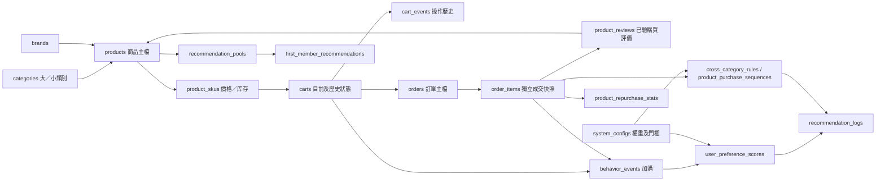

# Complete Schema v4 架構與遷移

更新：2026-09-19。來源文件版本 v1.0、日期 2026-09-18；本專案新的核心資料文件使用 schema_version=4，以区别先前已建立的 v2/v3。

## 文件優先序

本次使用者指定的 [VibeCart_AI_MongoDB_Complete_Schema.md](13_完整Schema_v1.0_來源快照.md) 優先，其次為購物車更新與舊整合規格。來源文件原樣保存；本文件標示實作選擇與補充欄位，不回頭修改來源或舊遷移 checksum。

## 目前架構



箭頭表示資料依賴；推薦、分數與統計的箭頭不代表排程／演算法已部署。已實作交易服務為 SKU CartService 與 ReviewService。

## 新舊結構對照

|範圍|舊版|本次|
|---|---|---|
|商品|products 一筆可售 SKU，含價格／庫存|products 主檔；product_skus 存規格／價格／庫存|
|分類|單層 category_id、slug|category_code、level、parent_id、path；商品保存大／小類別及path快照|
|會員|登入、角色、偏好|保留登入欄位，新增status/member_level/registered_at/首推時間/最後登入|
|訂單|orders.items 內嵌|orders 主檔＋order_items 獨立明細；不雙寫舊items|
|購物車|依product_id去重|依sku_id去重；相同商品不同規格可同車|
|購物車事件|operation_id／request_hash|保留防重欄位，新增全域唯一event_id、sku_id|
|購買行為|user_events 每訂單一筆|behavior_events 每訂單／商品一筆，可保存分類快照與數量|
|評價|無真實評價集合|product_reviews 與products真實彙總，預設4.0不算真實評價|
|AI推薦資料|BGE向量與舊推薦紀錄|新增偏好分數、推薦池、首推快照、推薦log、補貨統計及關聯規則|

## 為何實際是27集合

新版列出19個核心集合，全部已建立。先前8個集合未被明確授權刪除，因此保留：

- ai_requests、product_embeddings、ai_insights：AI執行、向量及洞察。
- ai_usage、request_limits、schema_migrations：配額、限流與遷移紀錄。
- user_events、recommendations：舊格式相容／歷史集合；新版SKU服務不再寫入，未作重複計分來源。

實際共27集合、27個strict/error validators、59個自訂索引與27個_id_索引，共86個。保留集合維持原schema_version；核心19集合統一v4。未刪除任何集合、業務文件或歷史遷移紀錄。

## 型別與未定義細節的實作選擇

- 原文允許ObjectId/String，參照本專案集合者统一ObjectId；category_path保存分類代碼字串。文件中的 baby_care 等示例不直接當作正式ObjectId。
- 金額统一Decimal128，API使用十進位字串；星等、權重、比例與相似度使用有限Double。SKU新增currency=TWD；圖片仍只保存URL／站內路徑。
- 保留users的auth_provider/password_hash/firebase_uid/role/is_active/preferences；status與is_active必須一致，登入仍為local。
- 保留orders的checkout_id/request_hash/is_demo/currency/paid_at/discount_amount，避免丟失既有防重與Demo分流。新subtotal取代舊subtotal_amount；允許非零shipping_fee，但Demo CartService目前由後端固定免運，未接物流計價。
- 保留carts.revision與cart_events.operation_id/request_hash；數量1～99、最多20個不同SKU。
- `brands`原文無欄位字典，新增最小brand_code/name/description/status及時間；brand_code唯一。
- `system_configs`原文無欄位字典，新增config_key/version/settings/status及時間，本版只定義recommendation_policy。後續其他政策以新遷移擴充，不任意塞未知結構。
- shipping_profile_id保留ObjectId/String/null，但原文沒有shipping_profiles集合定義，本次不捏造物流供應商或新集合。出貨設定的實際來源待物流整合。
- last_login_at、completed_at、未知補貨率及間隔可為null，避免偽造登入／完成／統計事實。

## 評價規則

新商品的DEFAULT資料必須是rating_count=0、rating_sum=0、rating_default_value=4.0、average_rating_raw=null、average_rating_display=4.0，星數分佈均0。Validator不會自動填預設值；商品建立服務須提供完整文件。

rating_count>0時必須為ACTUAL，rating_sum／count與星數分佈一致；平均顯示使用ceil((sum/count)*10)/10。ReviewService僅接受本人已付款且completed或delivered的order_item，發布評價與商品彙總在同一transaction中；同會員同明細唯一。只統計published，不將預設4.0納入。後續隱藏／刪除評價需另外實作管理服務與重算，不能只改review.status而不重算商品。

## 推薦政策已保存的值

|設定|值|
|---|---|
|行為權重|PURCHASE=4、ADD_TO_CART=3、SEARCH=2、PRODUCT_VIEW=1|
|半衰期天數|365、180、90、30（依上述順序）|
|分數上限|大類別70、小類別30；這不是分類數量上限|
|猜你喜歡／破圈|6／4|
|首次會員|ACTUAL且average_rating_display≥4.5，每啟用大類別隨機1項|
|新商品預設|4.0，不可進入首次會員實際評價池|
|破圈建議門檻|客戶≥500、共購≥50、confidence≥0.05、lift≥1.20|

只建立一筆recommendation_policy配置，不建立假推薦池、首推結果或關聯統計。首次推薦快照user_id唯一；還需由後續生成服務在同一transaction中確認／寫入users.first_recommendation_generated_at。不能僅靠資料庫索引宣稱首推流程已完成。

一般推荐log以最多6項、破圈最多4項驗證，候選不足可較少；資料庫無法保證實際候選數量充足。首次會員使用原文字段average_rating_display做4.5門檻，同時要求ACTUAL；若日後改為未進位的raw平均，需同步調整政策與查詢。

## 新服務與介面

- [SKU CartService](../services/sku_cart_service.py)：get_active_cart、add_item、update_quantity、remove_item、checkout_cart、abandon_cart。
- [ReviewService](../services/review_service.py)：create_review；驗證本人已完成／送達訂單明細並更新真實評價。

CartService的加入／修改／移除參數是sku_id，不能傳product_id。operation_id／checkout_id仍由前端對同一次操作固定保存。結帳需cart_id與expected_revision；在同一transaction中扣stock_quantity與available_quantity、保留reserved_quantity、建立orders/order_items/PURCHASE/CHECKOUT並converted，原車items保留。

同商品多SKU的購買量合併為一筆PURCHASE，避免同訂單同商品被多次計分。ADD同步建立ADD_TO_CART，之後由behavior_events.processed_at與唯一event_id配合分數處理器；本次尚未部署該處理器。cart_events不再另外作相同權重的加總來源。

原 [cart_service.py](../services/cart_service.py) 保留為舊schema服務與交易輔助基底，不是新環境入口；新服務覆寫所有依賴SKU／商品形狀的方法。舊Flask頁面未註冊新路由、未切換DB；不得直接將舊站.env指向此DB當作完成整合。

## 遷移與驗證

執行前以舊定義完整核對，確認6個重設計集合為空，新增集合不存在；保存 [更新前結構](14_完整Schema更新前結構.md)。新遷移20260918_04_complete_catalog_schema_v4以checksum追蹤，不重寫前三筆紀錄。

先建立新索引，再移除已知、被新設計取代的舊索引：例如products.sku改product_skus.sku_code、categories.name/slug改category_code、orders.created_at查詢改ordered_at。既有AI／配額索引不變，TTL仍只有ai_insights與request_limits。

DDL非整批原子；出錯會記failed並拒絕盲目重跑，需檢查部分狀態。若目標含實際舊業務資料，腳本會停止要求另做映射與備份，不用目前程式自動猜測價格／分類／訂單明細。

現行查核與測試（在C:/LLM/LLM_PJ執行）：

```powershell
& '.\MuscleCore分析資料\website\.venv\Scripts\python.exe' 'VibeCart_AI\MongoDB\audit_complete_v4.py'
& '.\MuscleCore分析資料\website\.venv\Scripts\python.exe' -m pytest 'VibeCart_AI\MongoDB\test_complete_v4.py' -q
```

新空環境依序：bootstrap_schema.py → migrate_cart_v3.py → migrate_schema_audit.py → migrate_complete_v4.py。前三者是不可改寫的歷史版本；現行結構以schema_complete_v4.py與audit_complete_v4.py為準。舊版測試需舊schema測試環境，不應對新版DB執行。

## 尚未部署範圍

本次完成資料庫設計、實際建置及必要SKU／評價服務驗證。完整Flask頁面與權限接線、首推生成服務、6+4候選排序、時間衰減處理器、12個月統計／關聯規則批次、每日／每週／每月排程及真實物流未部署。相關資料結構與政策已備妥，不以空集合存在宣稱這些功能已驗收。
