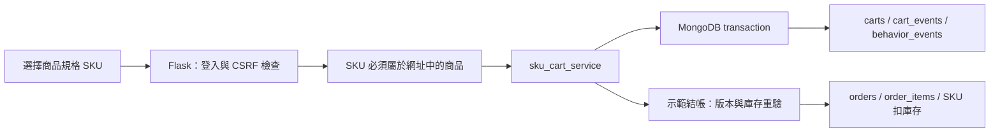
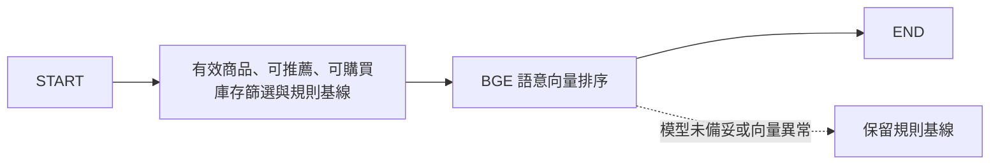

> 2026-10-02 更新：SAM 的後台、私有連線與真實 Atlas 驗證已交付，見 [後續交接](AI_DASHBOARD.md) 與 [讀回證據](V4_TEST_VERIFICATION.json)。下文 9/30 測試狀態保留為歷史紀錄。Live follow-up evidence supersedes the historical database UAT status; real model-provider checks remain pending.

# Flask × SKU 購物車 × LangGraph AI 串接

實作日期：2026-09-30。此分支提供可執行的模組串接與離線測試；不是 Atlas 上线或模型品質驗收證明。

## 架構與分工

保留既有 Flask 應用與歷史資料層，新增 `DATA_MODE=v4` 選擇新版路由。預設仍為 `legacy`；兩種模式不可共用不同格式的資料庫。沒有自動把舊會員、商品或 Session 購物車轉成 v4，因為商品與 SKU 的對照必須先確認。

| 層 | 實作位置（相對倉庫根目錄） | 職責 |
|---|---|---|
| Flask 路由 | `MuscleCore分析資料/website/app/store_v4.py` | 維持首頁、商品、購物車與結帳網址；新增改量、移除操作 |
| 購物車介接 | `MuscleCore分析資料/website/app/services/sku_gateway.py` | 引入 `VibeCart_AI/services/sku_cart_service.py`，轉換展示欄位與 Decimal128 |
| 會員 | `MuscleCore分析資料/website/app/auth.py` | v4 註冊欄位、display_name 登入、有效會員與管理員權限讀回 |
| 前後台 AI | `MuscleCore分析資料/website/app/services/ai_workflows.py` | LangGraph 流程、LangChain BGE/Claude adapter、快取與規則退回 |
| 後台 | `MuscleCore分析資料/website/app/admin.py` | v4 訂單與 SKU 彙總、人工觸發摘要 |
| 表單保護 | `MuscleCore分析資料/website/app/security.py` | Session CSRF，套用新舊模式的寫入表單 |

本次跨會員、資料層及 AI 分工，集中於 `feature/flask-sku-ai-integration` 供整體審查。後續可依 [分支規劃](README.md) 的四個功能範圍拆分工作。未變更 Schema、遷移 checksum 或共享購物車服務的交易實作。

## 購物流程



| 方法、網址 | 必要欄位 | 行為 |
|---|---|---|
| `GET /` | 可選 `q`、`category` | v4 商品頁；MVP 最多取 200 筆有效商品 |
| `GET /product/<product_id>` | 無 | 選擇規格；登入時記錄 v4 PRODUCT_VIEW |
| `POST /cart/add/<product_id>` | `sku_id`、`quantity`、`operation_id` | 新增數量，驗證 SKU 與商品對照 |
| `POST /cart/update/<sku_id>` | `quantity`、`operation_id` | 設定数量為 1–99 |
| `POST /cart/remove/<sku_id>` | `operation_id` | 移除 SKU |
| `GET /cart` | 無 | 讀取登入會員的持久購物車，以 Decimal 計算快照小計 |
| `POST /checkout` | `cart_id`、`expected_revision`、`checkout_id` | 版本檢查、交易式示範結帳 |
| `POST /admin/summary` | CSRF | 管理員手動產生摘要；一般 GET 不呼叫 Claude |

寫入請求都需表單 `csrf_token` 或 JSON 的 `X-CSRF-Token` header，取自當前 Session 的頁面。JSON 數量與版本必須是整數，不能使用布林、字串或小數。會員 ID 一律取登入 Session，忽略請求提供的 user_id。

每個表單產生獨立操作識別碼。網路失敗重送同一請求時保留原識別碼與原內容；新操作使用新碼。服務沿用原有防重複機制，結帳重送不重複扣庫存。購物車錯誤回傳 400、版本或識別碼衝突 409、資料庫不可用 503、未啟用示範結帳 403；未登入會轉向登入頁。HTML 成功後以 303 導向新頁。

`ENABLE_CHECKOUT=false` 為預設。啟用後沿用服務的 `is_demo=True` 訂單及示範 paid 狀態，沒有金流、付款成功回呼或物流串接，不得當成實際收款。價格以結帳當下 SKU 價格重新計算。

## 前台 AI：LangGraph + BGE



- 實際使用 `StateGraph` 組織節點；透過 LangChain `HuggingFaceEmbeddings` 呼叫 BGE。
- 預設模型 `BAAI/bge-small-zh-v1.5`，CPU、正規化向量，query 加中文檢索前綴；商品文字不加前綴。
- 以搜尋文字為優先，沒有搜尋時取最近最多 5 筆已知商品行為形成查詢。無行為、無查詢為冷啟動，使用規則推薦。
- 最多 200 筆候選，直接計算 cosine similarity；不是 Atlas Vector Search，沒有修改 MongoDB 驗證器或建立向量索引。
- 商品向量以文字快取，容量 512 筆；文字變更會重算。模型載入設定 `local_files_only=True`，需先下載到本機，網頁請求不自動下載模型。
- 離線測試使用替代 Embeddings 驗證真實 LangGraph 執行；尚未下載與實測 BGE 權重、中文推薦品質或延遲。
- 尚未實作完整規格中的跨類別規則、會員首次推薦池、分數衰減排程與 recommendation_logs 歸因。

## 後台 AI：LangGraph + LangChain + Claude

後台先由程式計算最近 100 筆訂單中的有效已付款金額、筆數、平均客單，及當前有效 SKU 的低庫存數量。退款、未付款、取消訂單不列入 v4 有效營收；示範訂單列入，頁面明確標示。

LangGraph 的摘要節點執行 `ChatPromptTemplate → ChatAnthropic → StrOutputParser`。只提供白名單彙總數字、幣別與範圍，沒有姓名、Email、會員 ID、原始訂單或商品自由文字。Claude 沒有資料庫或執行工具。輸出自動 HTML escape，人工核對後再採取營運行動。

模型 ID 使用 `CLAUDE_MODEL` 設定，不猜測帳戶可用型號。每次最多 600 output tokens、20 秒 timeout、1 次 retry；相同彙總與模型快取 300 秒，失敗結果暫存 30 秒。快取為單一程序記憶體，重啟失效，多 worker 不共享。缺少套件、API key、模型或 provider 異常會保留規則式摘要；不將例外或金鑰顯示給使用者。

## 本機啟用

在 `MuscleCore分析資料/website` 執行，使用現有 Python 3.11+ 虛擬環境：

```powershell
# 先驗證路由與真正的 LangGraph/Claude adapter，無模型下載
.venv\Scripts\python.exe -m pip install -r requirements-test.txt
.venv\Scripts\python.exe -m pytest tests -q -p no:cacheprovider

# 要使用本機 BGE 時，另安裝完整 AI 依賴（含較大的 PyTorch 依賴）
.venv\Scripts\python.exe -m pip install -r requirements-ai.txt
# 明確下載一次模型至本機套件快取
.venv\Scripts\python.exe -c "from sentence_transformers import SentenceTransformer; SentenceTransformer('BAAI/bge-small-zh-v1.5')"
```

在本機受忽略的 `.env` 設定下列欄位；不要把真實密鑰寫入 Git：

```dotenv
DATA_MODE=v4
MONGO_URI=<明確指定的測試 replica set 或 Atlas URI>
MONGO_DB=<已完成 v4 migration 的測試資料庫>
SECRET_KEY=<隨機且保密的 Session key>
ENABLE_CHECKOUT=false
AI_RECOMMENDATIONS_ENABLED=true
BGE_MODEL=BAAI/bge-small-zh-v1.5
AI_SUMMARY_ENABLED=true
ANTHROPIC_API_KEY=<本機填寫>
CLAUDE_MODEL=<帳戶可用的 Claude model ID>
LANGSMITH_TRACING=false
```

不要用舊 `seed_mongodb.py` 寫入 v4 資料庫。需先有符合 v4 schema 的會員、分類、商品及 SKU。切換資料庫或模式後重新登入；不遷移舊 Session 購物車。完整複製倉庫後從 website 啟動，介接模組會從固定的倉庫結構匯入 VibeCart_AI，單獨複製 website 不支援 v4 模式。

```powershell
.venv\Scripts\python.exe run.py
```

關閉 AI 旗標可回到規則模式；改回 legacy 時也要改回原本的 legacy 資料庫。LangGraph 並非購物交易引擎；購物車保持確定性的服務呼叫，避免模型決定金額或庫存。

## 驗證結果與 UAT

2026-09-30：離線測試 28 項通過，包含既有 2 項；`pip check` 無相依衝突。測試執行真實 LangGraph 與 LangChain chain、可建構 ChatAnthropic adapter，使用替代模型與 mongomock。測試用 CartService 僅在測試中以 callback(None) 代替 transaction；因此重送與欄位契約有測到，但不能證明 transaction rollback、併發與 Atlas validator。

| 待驗收項目 | 預期結果 | 實測結果／負責人 |
|---|---|---|
| 獨立 v4 測試庫註冊、登入 | 嚴格 validator 接受會員文件 | 待填 |
| 真實 replica set 新增、更新、移除 | cart/event 同交易提交 | 待填 |
| 兩人競爭最後庫存、交易中斷 | 不超賣、全數 rollback | 待填 |
| 重送同 checkout_id | 單一訂單、不重複扣庫存 | 待填 |
| BGE 本機模型、中文商品查詢 | 有效且有庫存商品，相關性與延遲可接受 | 待填 |
| Claude 測試 API | 繁中摘要、無虛構趨勢、彙總範圍正確 | 待填 |
| 桌面與手機表單 | SKU 選擇、數量、錯誤提示可操作 | 待填 |

## 培訓展示重點

可展示 StateGraph 的節點與狀態、LangChain provider 替換、Embedding 與 cosine 排序、Prompt/Model/Parser 串接、失敗退回、注入替代模型的離線測試。這是兩個受控 AI workflow，沒有多代理、工具自主操作或長期記憶，不宣稱為完整推薦系統。

官方參考：[LangGraph Graph API](https://docs.langchain.com/oss/python/langgraph/graph-api)、[LangChain Hugging Face embeddings](https://docs.langchain.com/oss/python/integrations/embeddings/huggingfacehub)、[LangChain ChatAnthropic](https://docs.langchain.com/oss/python/integrations/chat/anthropic)、[BGE 模型說明](https://huggingface.co/BAAI/bge-small-zh-v1.5)。

English summary: An opt-in v4 Flask adapter preserves the legacy mode while routing SKU operations through the existing transactional service. Two LangGraph workflows integrate BGE embeddings and LangChain ChatAnthropic, with safe deterministic fallbacks. Offline contract tests run the real graph runtime but replace model calls and database transactions. Live database validation, concurrency/rollback, BGE inference and paid Claude API verification remain UAT items.
